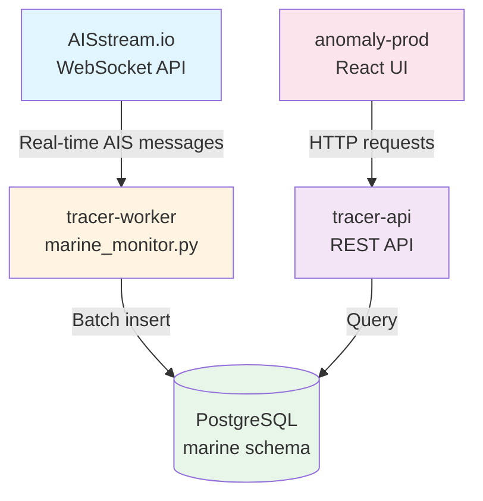
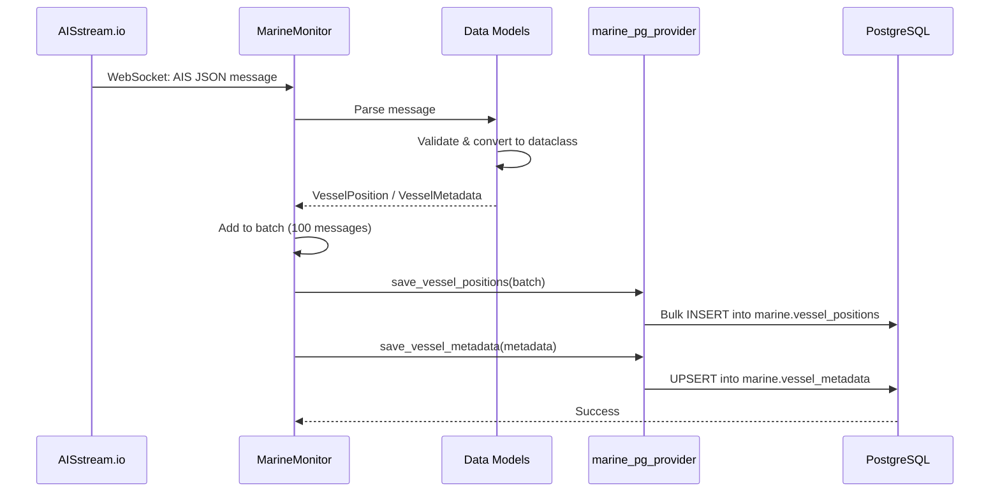
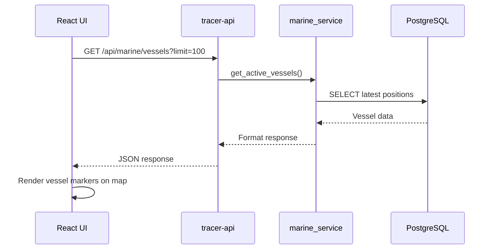
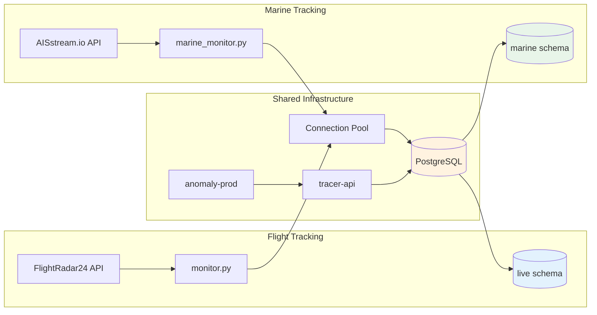

# Marine Data Pipeline - Architecture Overview

## System Overview

The marine vessel tracking system extends the existing Tracer platform to monitor ships worldwide using AIS (Automatic Identification System) data.



## Data Flow

### 1. Data Collection (tracer-worker)



### 2. Data Consumption (tracer-api + anomaly-prod)



## Components Architecture

### tracer-worker (Data Collection)

```
tracer-worker/
├── marine_monitor.py          # Main worker with WebSocket handling
├── marine_pg_provider.py      # Database operations
├── core/
│   └── marine_models.py       # VesselPosition, VesselMetadata
├── create_marine_schema.sql   # Database schema definition
├── run_marine_monitor.py      # Entry point script
├── MARINE_SETUP.md           # Setup documentation
└── requirements.txt           # Dependencies (added websockets)
```

**Key Classes:**
- `MarineMonitor`: WebSocket client, message routing, batch processing
- `VesselPosition`: Position report dataclass (with __slots__)
- `VesselMetadata`: Vessel static data dataclass
- `marine_pg_provider`: Database save/query functions

### tracer-api (REST API)

```
tracer-api/
├── routes/
│   └── marine_routes.py       # API endpoints (to be created)
├── service/
│   └── marine_service.py      # Business logic (to be created)
├── MARINE_INTEGRATION.md      # Integration guide
└── (existing files)
```

**Recommended Endpoints:**
- `GET /api/marine/vessels` - List active vessels
- `GET /api/marine/vessels/:mmsi` - Vessel details
- `GET /api/marine/vessels/:mmsi/track` - Track history
- `GET /api/marine/search` - Search vessels
- `GET /api/marine/statistics` - Traffic statistics

### anomaly-prod (React UI)

```
anomaly-prod/
├── src/
│   ├── types/
│   │   └── marine.ts          # TypeScript interfaces (to be created)
│   ├── api/
│   │   └── marine.ts          # API client (to be created)
│   ├── components/
│   │   └── MarineTracker.tsx  # UI components (to be created)
│   └── (existing files)
└── (existing files)
```

**UI Features:**
- Real-time vessel map with markers
- Vessel search and filtering
- Track history visualization
- Traffic statistics dashboard

## Database Schema

### marine.vessel_positions (Partitioned Table)

```
Primary Key: (id, timestamp)
Partitioned By: timestamp (monthly)

Columns:
├── id (BIGSERIAL)
├── mmsi (VARCHAR(9)) - Vessel identifier
├── timestamp (TIMESTAMP) - Position time
├── latitude, longitude (DECIMAL) - Position
├── speed_over_ground (DECIMAL) - Speed in knots
├── course_over_ground (DECIMAL) - Course in degrees
├── heading (INTEGER) - True heading
├── navigation_status (VARCHAR) - Current status
├── rate_of_turn (DECIMAL) - Turn rate
├── position_accuracy (BOOLEAN) - GPS accuracy
├── message_type (INTEGER) - AIS message type
└── received_at (TIMESTAMP) - When we received it

Indexes:
├── (mmsi, timestamp DESC) - Vessel history
├── (received_at DESC) - Recent data
└── (latitude, longitude) - Spatial queries
```

### marine.vessel_metadata (Regular Table)

```
Primary Key: mmsi

Columns:
├── mmsi (VARCHAR(9)) - Primary key
├── vessel_name (VARCHAR) - Ship name
├── callsign (VARCHAR) - Radio callsign
├── imo_number (VARCHAR) - IMO registry number
├── vessel_type (INTEGER) - AIS type code
├── vessel_type_description (VARCHAR) - Type name
├── length, width (INTEGER) - Dimensions in meters
├── draught (DECIMAL) - Draft in meters
├── destination (VARCHAR) - Reported destination
├── eta (TIMESTAMP) - Estimated arrival
├── cargo_type (INTEGER) - Cargo type code
├── dimension_* (INTEGER) - Detailed dimensions
├── position_fixing_device (INTEGER) - GPS type
├── first_seen (TIMESTAMP) - First tracked
├── last_updated (TIMESTAMP) - Last metadata update
└── total_position_reports (INTEGER) - Count

Indexes:
├── (vessel_name) - Search by name
├── (vessel_type) - Filter by type
├── (last_updated DESC) - Recently active
└── (destination) - Filter by destination
```

## Message Types

### AIS Position Report (Types 1, 2, 3, 18)

**Frequency:** Every 2-10 seconds (depending on vessel speed)

**Example Message:**
```json
{
  "MessageType": "PositionReport",
  "MetaData": {
    "MMSI": "368207620",
    "ShipName": "VESSEL_NAME"
  },
  "Message": {
    "PositionReport": {
      "Latitude": 37.7749,
      "Longitude": -122.4194,
      "Sog": 12.3,
      "Cog": 235.5,
      "TrueHeading": 240,
      "NavigationalStatus": 0,
      "RateOfTurn": -2.5,
      "PositionAccuracy": true,
      "Timestamp": "2026-02-12T14:30:00Z"
    }
  }
}
```

**Storage:** `marine.vessel_positions` table

### AIS Ship Static Data (Type 5)

**Frequency:** Every 6 minutes

**Example Message:**
```json
{
  "MessageType": "ShipStaticData",
  "MetaData": {
    "MMSI": "368207620"
  },
  "Message": {
    "ShipStaticData": {
      "Name": "EVER GIVEN",
      "CallSign": "HPEM",
      "ImoNumber": 9811000,
      "Type": 70,
      "Dimension": {
        "A": 250,
        "B": 150,
        "C": 30,
        "D": 29
      },
      "Draught": 14.5,
      "Destination": "SINGAPORE",
      "Eta": {"Month": 3, "Day": 15, "Hour": 14, "Minute": 30},
      "FixType": 1
    }
  }
}
```

**Storage:** `marine.vessel_metadata` table

## Performance Characteristics

### Data Volume

**Typical Load (Global Coverage):**
- ~50,000 active vessels worldwide
- ~5-10 position reports per vessel per minute
- **~250,000 - 500,000 messages per minute**
- After batching: ~2,500 - 5,000 DB inserts per minute

**Database Growth:**
- Position data: ~36M rows per day (global)
- Monthly partition: ~1.1B rows
- Storage: ~50-100 GB per month (compressed)

### Optimization Strategies

1. **Batch Processing**
   - Collect 100 messages before DB insert
   - Reduces DB load by 100x
   - Configurable via `AIS_BATCH_SIZE`

2. **Table Partitioning**
   - Monthly partitions on `vessel_positions`
   - Automatic partition pruning
   - Efficient time-range queries

3. **Connection Pooling**
   - Reuses existing pg_provider pool
   - 2-10 connections (configurable)
   - Thread-safe operations

4. **Indexing**
   - Multi-column indexes for common queries
   - Separate indexes for spatial, temporal, vessel lookups
   - Automatically used by query planner

## Monitoring & Operations

### Health Checks

**Worker Health:**
```bash
# Check if worker is running
ps aux | grep marine_monitor

# Check logs
tail -f tracer-worker/marine_monitor.log

# Check statistics in logs (printed every 60s)
```

**Data Health:**
```sql
-- Check recent data
SELECT COUNT(*) FROM marine.vessel_positions 
WHERE timestamp > NOW() - INTERVAL '10 minutes';

-- Should be > 0 if worker is running

-- Check vessel metadata
SELECT COUNT(*) FROM marine.vessel_metadata;
```

### Monitoring Metrics

**Key Metrics to Track:**
- Message receive rate (msg/sec)
- Positions saved (rows/sec)
- Unique vessels tracked
- Error count
- WebSocket reconnection frequency
- Database insert latency

**Example Monitoring Query:**
```sql
-- Positions per hour (last 24 hours)
SELECT 
    DATE_TRUNC('hour', timestamp) as hour,
    COUNT(*) as position_count,
    COUNT(DISTINCT mmsi) as unique_vessels
FROM marine.vessel_positions
WHERE timestamp > NOW() - INTERVAL '24 hours'
GROUP BY hour
ORDER BY hour DESC;
```

## Configuration

### Environment Variables

**Required:**
- `AIS_STREAM_API_KEY` - Your AISstream.io API key
- `PG_PASSWORD` - PostgreSQL password

**Optional:**
- `AIS_BOUNDING_BOX` - Geographic filter (default: global)
- `AIS_FILTER_MMSI` - Filter specific vessels
- `AIS_BATCH_SIZE` - Batch size (default: 100)
- `PG_HOST`, `PG_PORT`, `PG_DATABASE`, `PG_USER` - Database config

### Geographic Filtering

**Global Coverage (Default):**
```bash
export AIS_BOUNDING_BOX='[[[-90, -180], [90, 180]]]'
```

**Specific Regions:**
```bash
# Mediterranean Sea
export AIS_BOUNDING_BOX='[[[30, -6], [46, 37]]]'

# Multiple regions
export AIS_BOUNDING_BOX='[[[30, -6], [46, 37]], [[50, -130], [72, -55]]]'
```

## Integration Points

### Existing System Integration



**Shared Components:**
- PostgreSQL database and connection pool
- Authentication system (tracer-api)
- UI framework and components (anomaly-prod)
- Deployment infrastructure

**Separate Components:**
- Data sources (FlightRadar24 vs AISstream.io)
- Worker processes (monitor.py vs marine_monitor.py)
- Database schemas (live vs marine)
- API endpoints (flights vs vessels)

## Security Considerations

1. **API Key Management**
   - Store AIS_STREAM_API_KEY in environment variables
   - Never commit to source control
   - Rotate keys periodically

2. **Database Access**
   - Use connection pooling
   - Apply principle of least privilege
   - Monitor for unusual query patterns

3. **Rate Limiting**
   - Implement rate limits on API endpoints
   - Prevent abuse of marine data endpoints
   - Cache frequently accessed data

4. **Data Privacy**
   - AIS data is public information
   - No PII (Personally Identifiable Information)
   - MMSI is vessel identifier, not person

## Future Enhancements

### Phase 2 Features

1. **Anomaly Detection for Vessels**
   - Unusual routes or speed patterns
   - Vessels entering restricted areas
   - Collision risk detection

2. **Port Traffic Analysis**
   - Track vessels by destination
   - Estimate port congestion
   - Arrival/departure predictions

3. **Historical Analysis**
   - Archive old data to research schema
   - Vessel behavior patterns
   - Traffic trend analysis

4. **Real-time Alerts**
   - WebSocket updates for live tracking
   - Notifications for specific events
   - Custom alert rules

5. **Advanced Visualizations**
   - Traffic heatmaps
   - Vessel trajectory prediction
   - 3D visualization with deck.gl

## Documentation Index

**Setup & Operations:**
- `tracer-worker/MARINE_SETUP.md` - Initial setup guide
- `tracer-worker/create_marine_schema.sql` - Database schema
- This file - Architecture overview

**API Integration:**
- `tracer-worker/MARINE_DATA_API.md` - Complete API documentation
- `tracer-api/MARINE_INTEGRATION.md` - Backend integration guide

**Code Examples:**
- `tracer-worker/marine_monitor.py` - Worker implementation
- `tracer-worker/core/marine_models.py` - Data models
- `tracer-api/MARINE_INTEGRATION.md` - API examples

## Quick Reference

### Start Marine Worker
```bash
cd tracer-worker
export AIS_STREAM_API_KEY="your_key"
export PG_PASSWORD="your_password"
python run_marine_monitor.py
```

### Query Recent Vessels
```sql
SELECT vp.mmsi, vm.vessel_name, vp.latitude, vp.longitude
FROM marine.vessel_positions vp
LEFT JOIN marine.vessel_metadata vm USING (mmsi)
WHERE vp.timestamp > NOW() - INTERVAL '10 minutes'
ORDER BY vp.timestamp DESC LIMIT 10;
```

### API Endpoint (Once Implemented)
```bash
curl http://localhost:8000/api/marine/vessels?limit=10
```

---

**Architecture Version:** 1.0  
**Last Updated:** February 12, 2026  
**Status:** Phase 1 Complete (Data Collection), Phase 2 Pending (API Integration)
